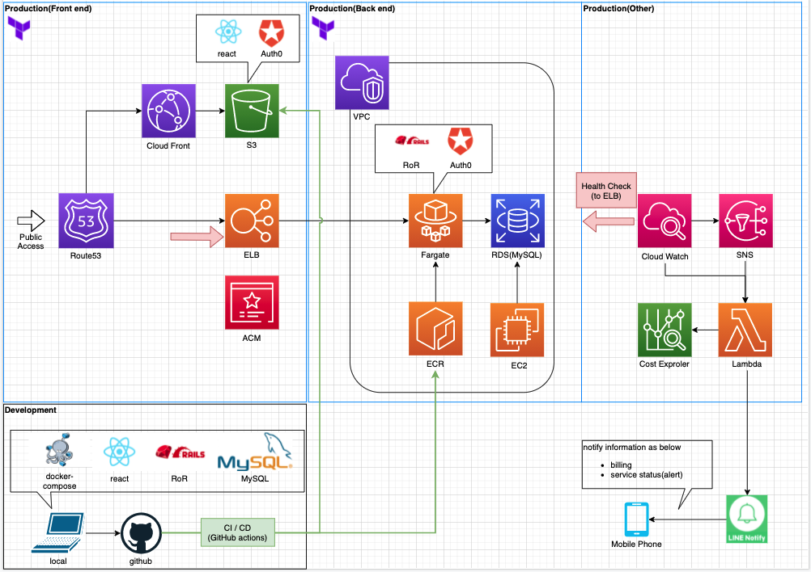

# guteam
## 愚痴〜ム　　
### このアプリについて
「愚痴〜ム」とは、愚痴でつながる新感覚SNSです。  
日頃の悩みを呟いたり、似たような仲間同士でつながったり、  
ふだんは話せないようなことを言い合える仲間たちを見つけることができます。

### 作成した目的  
とかくストレスの多い現代社会において、言いたいことも誰にも言えず、ストレスを溜め込んでいる人々を救うために作成しました。  
人間は多かれ少なかれ愚痴を吐く生き物です。  
愚痴を吐くことには、いくつかデメリットがあると思います。  

1. 現実空間で愚痴を吐くと、聞き手のストレスになってしまったり、同僚や上司に不快感を与えてしまう恐れがある。  
2. SNS上で愚痴を吐くと、本人の意図にかかわらず、公的信頼を損なう可能性がある。

デメリットがある一方、愚痴を吐くことにはある種のメリットがあると考えます。

1. 問題を正しく認識することができ、解決の糸口が見つかる。  
2. 口に出すことによって、心のモヤモヤが晴れる。

愚痴を吐くことのデメリットを回避しつつ、メリットを享受することができる環境があればいいのではないかと考え、  
「愚痴〜ム」を開発しました。  

## 使い方
### ①サインアップする
https://guteam.net にアクセスし、ユーザー登録(サインアップ)をしてください。  
※一度サインアップをすると、それ以降は「ログイン」よりアクセスが可能です。

### ②プロフィールを編集する
愚痴〜ムにログインしたら、「プロフィール」を編集してみましょう。  
※「タイムライン」等でアイコンをクリックすることで、他のユーザーのプロフィールを確認することができます。

### ③愚痴を吐く
「タイムライン」などで、愚痴をはきましょう。  
※機能は順次追加予定です。  
  
### ※テスト用のユーザーをご用意しておりますので、お気軽にご利用ください。  
#|  ID  |  Password  |
|----| ---- | ---- |
|1|  guteam2021＠gmail.com  |  guteamguest  |
|2|  guteam.reiwa3＠gmail.com  |  guteamguest  |

※迷惑メール防止のため、「＠」を全角にしております。ログイン時は、「＠」を半角にしてください。 

## URL　　
https://guteam.net/
## 技術　　
### 使用技術一覧
- フロントエンド
    - react@17.0.2
    - node v14.17.4
    - yarn  1.22.11
        - jest:26.6.3
        - reduxjs/toolkit:1.6.1
    - typescript@3.9.7
    - Material-UI  [v4.0](https://v4.mui.com/)
- サーバーサイド
    - ruby 2.6.8p205 
    - Rails 6.1.4  
    - rspec-core 3.10.1
    - Python 2.7(Lambda関数にて使用)
- インフラ
    - AWS
      - S3 ,Route53, Cloud Front, ACM, IAM, VPC, EC2, ALB, ECS(Fargate), ECR, RDS,Cost Explorer, CloudWatch,  Lambda, SNS
    - MySQL 5.7
    - Docker version 19.03.13
    - docker-compose version 1.27.4
    - Terraform(予定)
- XaaS
    - [auth0](https://auth0.com/jp)
    - [GitHub](https://github.co.jp/)
        - GitHub Actions
    - [LINE Notify](https://notify-bot.line.me/ja/)
### 論理構成図

### E-R図

## 機能一覧
1. サインアップ/ログイン/ログアウト機能  
    - ユーザーが新規にアカウントを作成できる
    - ユーザーがアカウントを作成し、そのログインID / Passwordを利用して、ログインおよびログアウトができる
2. プロフィール機能  
    - ユーザーがニックネーム、プロフィール写真、自己紹介文などから構成されるプロフィールを設定できる
    - プロフィールはユーザー間で確認できる
3. タイムライン機能
    - ユーザーが一定文字数以内の、メッセージを投稿できる
    - 投稿したメッセージは、ユーザー間で確認できる
4. ページタイトル表示機能
    - ユーザーが、現在いるページの名称を確認できる(タイムライン、プロフィールなど)
5. お知らせ機能
    - ユーザーが、管理人からのメッセージ、または特定のユーザーから向けられた通知を確認できる
